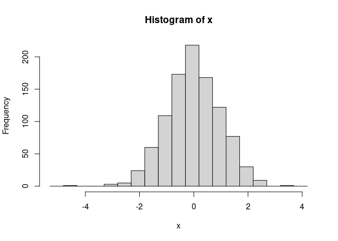

---
output:
  html_document:
    keep_md: yes
  pdf_document: default
---

<script>
function buildQuiz(myq, qc){
  // variable to store the HTML output
  const output = [];

  // for each question...
  myq.forEach(
    (currentQuestion, questionNumber) => {

      // variable to store the list of possible answers
      const answers = [];

      // and for each available answer...
      for(letter in currentQuestion.answers){

        // ...add an HTML radio button
        answers.push(
          `<label>
            <input type="radio" name="question${questionNumber}" value="${letter}">
            ${letter} :
            ${currentQuestion.answers[letter]}
          </label><br/>`
        );
      }

      // add this question and its answers to the output
      output.push(
        `<div class="question"> ${currentQuestion.question} </div>
        <div class="answers"> ${answers.join('')} </div><br/>`
      );
    }
  );

  // finally combine our output list into one string of HTML and put it on the page
  qc.innerHTML = output.join('');
}

function showResults(myq, qc, rc){

  // gather answer containers from our quiz
  const answerContainers = qc.querySelectorAll('.answers');

  // keep track of user's answers
  let numCorrect = 0;

  // for each question...
  myq.forEach( (currentQuestion, questionNumber) => {

    // find selected answer
    const answerContainer = answerContainers[questionNumber];
    const selector = `input[name=question${questionNumber}]:checked`;
    const userAnswer = (answerContainer.querySelector(selector) || {}).value;

    // if answer is correct
    if(userAnswer === currentQuestion.correctAnswer){
      // add to the number of correct answers
      numCorrect++;

      // color the answers green
      answerContainers[questionNumber].style.color = 'lightgreen';
    }
    // if answer is wrong or blank
    else{
      // color the answers red
      answerContainers[questionNumber].style.color = 'red';
    }
  });

  // show number of correct answers out of total
  rc.innerHTML = `${numCorrect} out of ${myq.length}`;
}
</script>


<style type="text/css">
.colsel {
background-color: lightyellow;
}

pre, code {
  white-space:pre !important;
  overflow-x:scroll auto
}
</style>


# Intro to R Day 3

---

Load your day 2 workspace data:

```{.r .colsel}
load("day2.RData")
```


### Loops

In programming, it is common that one has to do one set of specific operation on a sequence of elements. In this case, *for* loop is very useful to achieve the goal.

The basic structure of *for* loop is:

**for (value in sequence){**

**some operation(s)**

**}**


For example, we would like to calculate the sum of a row for every row in the matrix we created earlier. We are going to use a *for* loop to do it.


```{.r .colsel}
for (i in 1:dim(my_matrix)[1]) {
  out <- sum(my_matrix[i, ])
  print(out)
}
```

```
## [1] 11
## [1] 58
## [1] 302
## [1] 38
```

There is a **while** loop in R similarly as in command line or any other programming language. The basic structure of a *while* loop is:

**while (condition){**

  **some operation**

**}**


Here is the same row sum calculation using a while loop:


```{.r .colsel}
i=1 # need to initialize i
while (i <= dim(my_matrix)[1]){
  out <- sum(my_matrix[i,])
  print(out)
  i <- i + 1
}
```

```
## [1] 11
## [1] 58
## [1] 302
## [1] 38
```


<br>

---

### The "apply" family of functions

#### A few useful functions: apply(), lapply(), sapply(), and tapply() to replace for loop

##### apply() takes an array or matrix as input and outputs a vector, array or list.


```{.r .colsel}
# recall my_matrix
my_matrix
```

```
##      col1 col2 col3
## row1    1    2    8
## row2    3   18   37
## row3    8   27  267
## row4    9   10   19
```

```{.r .colsel}
# check the usage of apply() function
?apply()
# calculate sums for each row
apply(my_matrix, MARGIN=1, sum)
```

```
## row1 row2 row3 row4 
##   11   58  302   38
```


##### lapply() takes a list, vector or data frame as input and outputs a list.


```{.r .colsel}
?lapply()

# generate some random data matrix
data3 <- as.data.frame(matrix(rnorm(49), ncol=7), stringsAsFactors=F)
dim(data3)
```

```
## [1] 7 7
```

```{.r .colsel}
# calculate the sum for each row
lapply(1:dim(data3)[1], function(x){sum(data3[x,])})
```

```
## [[1]]
## [1] 2.8326
## 
## [[2]]
## [1] 2.296321
## 
## [[3]]
## [1] -2.978004
## 
## [[4]]
## [1] -0.9896983
## 
## [[5]]
## [1] -0.493145
## 
## [[6]]
## [1] -1.701257
## 
## [[7]]
## [1] -6.009424
```

```{.r .colsel}
# comparing the results to apply() results
apply(data3, MARGIN=1, sum)
```

```
## [1]  2.8326003  2.2963210 -2.9780037 -0.9896983 -0.4931450 -1.7012568 -6.0094243
```

```{.r .colsel}
# calculate log10 of the sum of each row
lapply(1:dim(data3)[1], function(x){log10(sum(data3[x,]))})
```

```
## Warning in FUN(X[[i]], ...): NaNs produced

## Warning in FUN(X[[i]], ...): NaNs produced

## Warning in FUN(X[[i]], ...): NaNs produced

## Warning in FUN(X[[i]], ...): NaNs produced

## Warning in FUN(X[[i]], ...): NaNs produced
```

```
## [[1]]
## [1] 0.4521853
## 
## [[2]]
## [1] 0.3610326
## 
## [[3]]
## [1] NaN
## 
## [[4]]
## [1] NaN
## 
## [[5]]
## [1] NaN
## 
## [[6]]
## [1] NaN
## 
## [[7]]
## [1] NaN
```

##### The function sapply() works like function lapply(), but tries to simplify the output to the simplest data structure possible. As a matter of fact, sapply() is a "wrapper" function for lapply(). By default, it returns a vector.


```{.r .colsel}
# To check the syntax of using sapply():
?sapply()

sapply(1:dim(data3)[1], function(x){log10(sum(data3[x,]))})
```

```
## Warning in FUN(X[[i]], ...): NaNs produced

## Warning in FUN(X[[i]], ...): NaNs produced

## Warning in FUN(X[[i]], ...): NaNs produced

## Warning in FUN(X[[i]], ...): NaNs produced

## Warning in FUN(X[[i]], ...): NaNs produced
```

```
## [1] 0.4521853 0.3610326       NaN       NaN       NaN       NaN       NaN
```

##### If the "simplify" parameter is turned off, sapply() will produced exactly the same results as lapply(), in the form of a list. By default, "simplify" is turned on.

```{.r .colsel}
sapply(1:dim(data3)[1], function(x){log10(sum(data3[x,]))}, simplify=FALSE)
```

```
## Warning in FUN(X[[i]], ...): NaNs produced

## Warning in FUN(X[[i]], ...): NaNs produced

## Warning in FUN(X[[i]], ...): NaNs produced

## Warning in FUN(X[[i]], ...): NaNs produced

## Warning in FUN(X[[i]], ...): NaNs produced
```

```
## [[1]]
## [1] 0.4521853
## 
## [[2]]
## [1] 0.3610326
## 
## [[3]]
## [1] NaN
## 
## [[4]]
## [1] NaN
## 
## [[5]]
## [1] NaN
## 
## [[6]]
## [1] NaN
## 
## [[7]]
## [1] NaN
```

#### The function tapply() applys a function to each subset of a vector based on a second vector of factors.


```{.r .colsel}
?tapply()

# Let's use Fisher's Iris data to demonstrate the usage of tapply().
# First, load the Iris dataset
data(iris)

# Take a look at what the data includes
head(iris)
```

```
##   Sepal.Length Sepal.Width Petal.Length Petal.Width Species
## 1          5.1         3.5          1.4         0.2  setosa
## 2          4.9         3.0          1.4         0.2  setosa
## 3          4.7         3.2          1.3         0.2  setosa
## 4          4.6         3.1          1.5         0.2  setosa
## 5          5.0         3.6          1.4         0.2  setosa
## 6          5.4         3.9          1.7         0.4  setosa
```

```{.r .colsel}
# Generate a summary of the sepal lengths for each iris species.
tapply(iris$Sepal.Length, iris$Species, summary)
```

```
## $setosa
##    Min. 1st Qu.  Median    Mean 3rd Qu.    Max. 
##   4.300   4.800   5.000   5.006   5.200   5.800 
## 
## $versicolor
##    Min. 1st Qu.  Median    Mean 3rd Qu.    Max. 
##   4.900   5.600   5.900   5.936   6.300   7.000 
## 
## $virginica
##    Min. 1st Qu.  Median    Mean 3rd Qu.    Max. 
##   4.900   6.225   6.500   6.588   6.900   7.900
```


### User defined functions

Even though there are a lot of R packages available, there are always situations where one might have to write one's own function to accomplish some very specific goals. Functions are defined by code with a specific format:

**function.name <- function(arg1=arg1, arg2, ...){**

**var <- sin(arg1) + sin(arg2)  # carry out tasks**

**var / 2**

**}**

Here, we are going to write a function to calculate the area of a triangle given the lengths of three sides.


```{.r .colsel}
my.area <- function(side1, side2, side3){
	half_perimeter <- (side1 + side2 + side3) / 2
	area <- sqrt(half_perimeter * (half_perimeter - side1) * (half_perimeter - side2) * (half_perimeter - side3))
	return(area)
}

# let's carry out a test
my.area(side1=3, side2=4, side3=5)
```

```
## [1] 6
```

<br>

## Quiz 5

<div id="quiz5" class="quiz"></div>
<button id="submit5">Submit Quiz</button>
<div id="results5" class="output"></div>
<script>
quizContainer5 = document.getElementById('quiz5');
resultsContainer5 = document.getElementById('results5');
submitButton5 = document.getElementById('submit5');

myQuestions5 = [
  {
    question: "Find the area of a triangle with sides 32, 22, and 40:",
    answers: {
      a: "352.3445",
      b: "351.2478",
      c: "350.2112",
      d: "354.7849"
    },
    correctAnswer: "b"
  },
  {
    question: "Use the 'sd' function along with sapply to get the standard deviation for every row in data1. Then find the maximum of those values:",
    answers: {
      a: "26106.23",
      b: "26107.23",
      c: "26108.23",
      d: "26105.23"
    },
    correctAnswer: "a"
  },
  {
    question: "Now, using the apply function find only those rows whose standard deviation is greater than 20000. What is the row name?",
    answers: {
      a: "AT1G21310",
      b: "AT3G09260",
      c: "AT1G67090",
      d: "AT3G53420"
    },
    correctAnswer: "b"
  }
];

buildQuiz(myQuestions5, quizContainer5);
submitButton5.addEventListener('click', function() {showResults(myQuestions5, quizContainer5, resultsContainer5);});
</script>

---


## CHALLENGE

Write a function to calculate min-max normalization for a single row. Here is the formula:


Then use apply to normalize every row of data2. You might want to take a small piece of data2 to test it with, e.g. the first 3 rows and first 3 columns.

## HARD CHALLENGE

Now take your normalized data and write a function to find the log2-fold change (i.e. the log of the ratio of normalized counts) between any two samples across all genes. Then use one of the apply functions to calculate log2-fold change across ALL samples, given one sample. Finally, use a for loop to find the pair-wise log2-fold changes for every pair of samples.

---

Topic 6. Simple data visulization in R
====================================================

Scatter plot and line plot can be produced using the function plot().


```{.r .colsel}
x <- c(1:50)
y <- 1 + sqrt(x)/2
plot(x,y)
```

<!-- -->

```{.r .colsel}
plot(x,y, type="l")
```

<!-- -->

```{.r .colsel}
# plot both the points and lines
## first plot points
plot(x,y)
lines(x,y, type="l")
```

<!-- -->

```{.r .colsel}
## lines() can only be used to add information to a graph, while it cannot produce a graph on its own.
```


boxplot() can be used to summarize data.


```{.r .colsel}
boxplot(data3, xlab="Sample ID", ylab="Raw Counts")
```

<!-- -->


```{.r .colsel}
x <- rnorm(1000)
boxplot(x)
```

<!-- -->

hist() can be used to create histograms of data.

```{.r .colsel}
hist(x)
```

<!-- -->

```{.r .colsel}
# use user defined break points
hist(x, breaks=seq(range(x)[1]-1, range(x)[2]+1, by=0.5))
```

<!-- -->


```{.r .colsel}
# clear plotting device/area
dev.off()
```

```
## null device 
##           1
```


---

Topic 7. Install packages in R
====================================================

##### Starting from Bioconductor version 3.8, the installation of packages is recommended to use BiocManager.


```{.r .colsel}
if (!requireNamespace("BiocManager"))
	install.packages("BiocManager")
## install core packages
BiocManager::install()
## install specific packages
BiocManager::install(c("devtools", "tidyverse","bsseq","DSS"))
```

* Bioconductor has a repository and release schedule that differ from R (Bioconductor has a ‘devel’ branch to which new packages and updates are introduced, and a stable ‘release’ branch emitted once every 6 months to which bug fixes but not new features are introduced). This mismatch causes that the version detected by install.packages() is sometimes not the most recent 'release'.

* A consequence of the distinct 'devel' branch is that install.packages() sometimes points only to the 'release' repository, while users might want to have access to the leading-edge features in the develop version.

* An indirect consequence of Bioconductor's structured release is that packages generally have more extensive dependences with one another.


##### <font color='orange'>It is always recommended to update to the most current version of R and Bioconductor. If it is not possible and R < 3.5.0, please use the legacy approach to install Bioconductor packages</font>   


```{.r .colsel}
source("http://bioconductor.org/biocLite.R")
## install core packages
biocLite()
## install specific packages
biocLite(c("devtools", "tidyverse","bsseq","DSS"))
```
   
##### The R function install.packages() can be used to install packages that are not part of Bioconductor.


```{.r .colsel}
install.packages("ggplot2")
install.packages(c("kableExtra","knitr","dplyr","reshape2"))
```

##### Install from source of github.

```{.r .colsel}
library(devtools)
install_github("stephenturner/qqman")
```

---

Topic 8. Slightly more advanced visualization
====================================================

Working with an R notebook, we will load the Iris data as we did earlier in this documentation, generate a table that lists the median of each measurement (Sepal.Length, Sepal.Width, Petal.Length, Petal.Width) for each species. Then we will generate plots based on the result. Finally produce an html report with the table and the plot.

#### Install some packages

* In order to output a nice looking table in the final report, one may consider the R package kableExtra https://github.com/haozhu233/kableExtra. One may also check out the documentation at https://cran.r-project.org/web/packages/htmlTable/vignettes/

* Figure 1 can be produced using base R functions: plot(), points(), axis(), text().

* Figure 2 can be produced using functions in R package lattice https://cran.r-project.org/web/packages/lattice/index.html

* Figure 3 can be produced using function boxplot()


```{.r .colsel}
library(lattice)
library(reshape2)
library(kableExtra)
tmp <- sapply(1:4, function(x){tapply(iris[,x], iris[[5]], median)})
colnames(tmp) <- colnames(iris)[1:4]
nms <- colnames(tmp)
kable(data.frame(tmp, stringsAsFactors=F), align='c') %>% kable_styling(bootstrap_options=c("striped", "hover", "responsive"), full_width=F, position="center")
```

<table class="table table-striped table-hover table-responsive" style="width: auto !important; margin-left: auto; margin-right: auto;">
 <thead>
  <tr>
   <th style="text-align:left;">  </th>
   <th style="text-align:center;"> Sepal.Length </th>
   <th style="text-align:center;"> Sepal.Width </th>
   <th style="text-align:center;"> Petal.Length </th>
   <th style="text-align:center;"> Petal.Width </th>
  </tr>
 </thead>
<tbody>
  <tr>
   <td style="text-align:left;"> setosa </td>
   <td style="text-align:center;"> 5.0 </td>
   <td style="text-align:center;"> 3.4 </td>
   <td style="text-align:center;"> 1.50 </td>
   <td style="text-align:center;"> 0.2 </td>
  </tr>
  <tr>
   <td style="text-align:left;"> versicolor </td>
   <td style="text-align:center;"> 5.9 </td>
   <td style="text-align:center;"> 2.8 </td>
   <td style="text-align:center;"> 4.35 </td>
   <td style="text-align:center;"> 1.3 </td>
  </tr>
  <tr>
   <td style="text-align:left;"> virginica </td>
   <td style="text-align:center;"> 6.5 </td>
   <td style="text-align:center;"> 3.0 </td>
   <td style="text-align:center;"> 5.55 </td>
   <td style="text-align:center;"> 2.0 </td>
  </tr>
</tbody>
</table>

# scatter plot of mean measurement

```{.r .colsel}
species <- as.vector(levels(iris$Species))
x <- c(1, 2, 3, 4)
plot(x, tmp["setosa",], pch=20, col='red', ylim=c(0, max(tmp)), xaxt="n", xlab="Measurement type", ylab="Measurement results", cex.lab=1.0)
points(x, tmp["virginica",], pch=20, col='orange')
points(x, tmp["versicolor",], pch=20, col='blue')
axis(1, at=x, labels=nms, las=2, cex.axis=0.7)
text(c(1.5,1.5,1.5), c(0, 0.7, 1.4), labels=species, col=c("red", "blue", "orange"), cex=1.5)
```

<!-- -->

# scatter plot of measurement by species

```{.r .colsel}
dd <- melt(iris)
```

```
## Using Species as id variables
```

```{.r .colsel}
xyplot(value ~ variable | Species, data=dd, scales=list(x=list(rot=90)), xlab="Measurements", ylab="Values")
```

<!-- -->


# boxplot by group

```{.r .colsel}
cols <- c("red", "blue", "orange")
boxplot(value ~ Species + variable, data=dd, col = cols, xaxt="n", yaxt="n", xlab="Measurement Type", ylab="Values")
axis(side=1, labels=FALSE)
axis(side=2, las=2)
text(x=1:12, y=par("usr")[3] - 0.85, labels=c("", "Sepal.Length", "", "", "Sepal.Width", "", "", "Petal.Length", "", "", "Petal.Width", ""), xpd=NA, srt=35, cex=1)
legend("topright", fill=cols, legend=levels(dd$Species))
```

<!-- -->

---

## VISUALIZATION CHALLENGE

Download the gapminder dataset to your Rstudio session using the following URL:

https://github.com/ucdavis-bioinformatics-training/2023-February-Introduction-to-R-for-Bioinformatics/raw/main/R/gapminder.csv

Take a look at the dataset. Subset the data to only look at rows from 1982. Then make a scatterplot of gdp vs life exp (using the plot function) of the subset, adding x and y labels. Find out how to log scale the x axis from the "plot.default" documentation.

Next, make a named vector of colors with the names being the continents. Use the vector to add colors to each point based on the continent for that point. You may need to look at the "col" section in the "plot.default" documentation. You can also use the "colors()" function to get a list of all of the available colors. Add a legend to the plot showing which colors correspond to which continent.

Finally, create a function that takes in a numeric vector and a minimum and maximum circle size. Within the function, take the square root of the vector, then use the min-max normalization method to normalize each element of the vector. Once you have normalized data, use those values to scale between the minimum and maximum circle size. Use this function to change the size of the circles to correspond to the population of the country using the "cex" parameter for the scatter plot.


